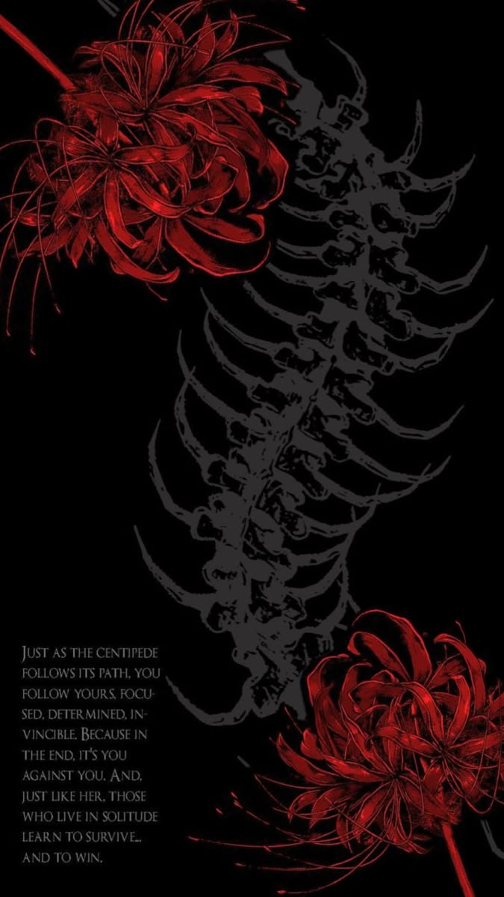
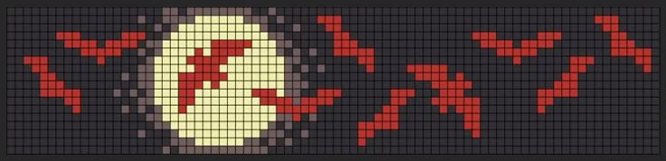

  <!-- Твой главный баннер со сколопендрой -->
  

<table width="100%">
  <tr>
    <!-- Блок досье с твоей аватаркой -->
    <td width="30%" align="center" valign="top">
       
      <code>> [ python backend dev ]</code>
    </td>
    <!-- Основной инфо-блок -->
    <td width="70%" valign="top">
      <h2>Winston010n // Profile</h2>
      
<b>Стек / Способности:</b>

      <ul>
        <li><code>Python</code></li>
        <li><code>Aiogram (Telegram-боты)</code></li>
        <li><code>SQL</code></li>
      </ul>
    </td>
  </tr>
</table>

---

  <!-- Пиксельный виджет с луной -->
  

<h2 align="center">КТО Я, ПО-ТВОЕМУ?</h2>

---

## // ТГ БОТЫ / RELEASES
* 🤖 **Telegram Bot** — Асинхронный бэкенд на aiogram.

## 📊 Моя активность

  

  <code>> current target: SSS-Class Ghoul [АКТИВЕН]</code>

